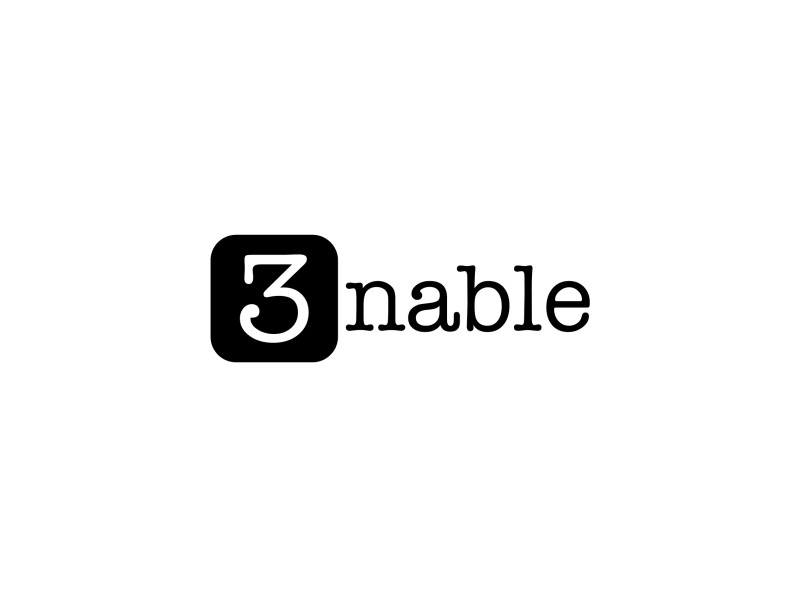

# 3nable

Allows you to interact with dApps without a Web3.0 provider or pulling your keys into a browser



Devpost: LINK

## Overview

PUT SOMETHING HERE

## Technology

A user id is associated with a private key, which is stored privately in an Enigma secret contract. Upon login on 3nable, a user can create a one-time (time-bound) access code that is linked to the user id and stored in an Enigma secret contract (similar to 2FA). I.e. for a short period of time, there exists a link of private key <--> user id <--> code. 

A DApp that uses 3nable for login (or signing transactions) prompts users for this access code. When the code is provided to 3nable's login on the DApp, a function within the Enigma secret contract will retrieve the private key and use it to sign a message or a transaction within the Trusted Execution Environment.

### Secret contract functions

* `fn add_user(user_id: String, private_key: Vec<u8>)`

  adds a `User` object containing `user_id` and `private_key` to the secret contract

* `fn add_login(user_id: String, code: U256)`

  adds a `Login` object containing `user_id` and `code` to the secret contract
    
* `fn sign_message(code: U256, message: String) -> (Vec<u8>, Vec<u8>)`

  * uses `code` to find the corresponding `Login` object;
  * uses the `user_id` stored within the `Login` object to find the corresponding `User` object;
  * uses the `private_key` stored within the `User` object to to sign a message;
  * returns `signed_message` and the `public_key` associated with the `private_key`

### Compile the secret contract

Clone the 3nable repository as well as the enigma-core repository
```
git clone git@github.com:3nable-login/3nable.git
git clone git@github.com:enigmampc/enigma-core.git
```

Make sure that you have Enigma's [`discovery-cli`](https://github.com/enigmampc/discovery-cli) installed. Then, compile the contract by simply running
```
discovery compile
```

### Test the secret contract

In a separate terminal tab, start the Enigma development environment
```
discovery start
```
Back in the first tab, navigate inside the 3nable directory and run the test command
```
cd 3nable
discovery test
```

### Deploy the secret contract

Make sure you have the Enigma development environment running. Then execute
```
discovery migrate
```

## Additional Resources

* Pitch Deck:
* User-flow Mockup: 